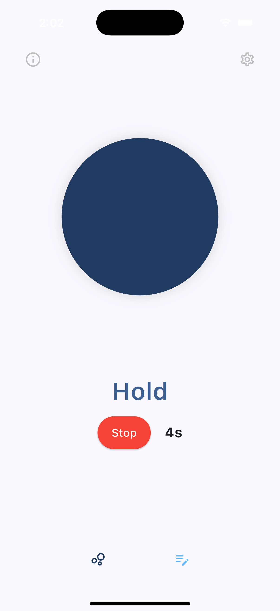
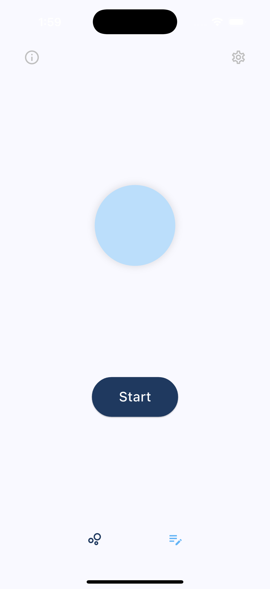
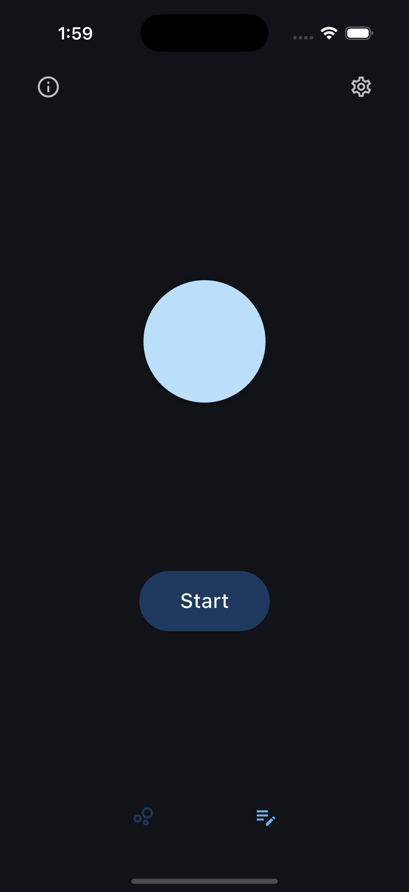
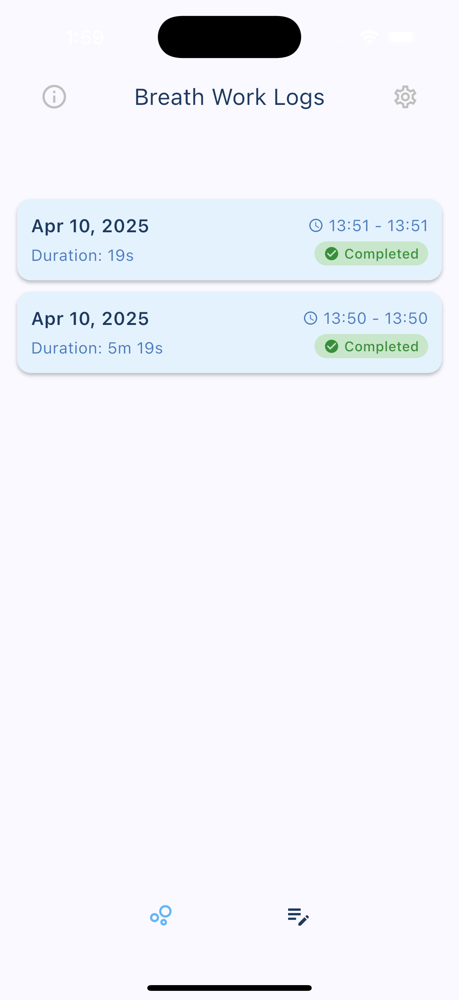
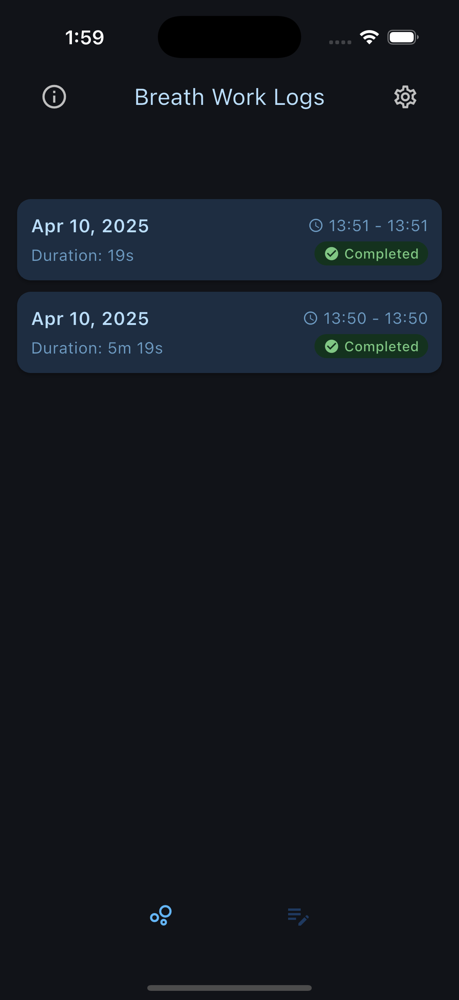
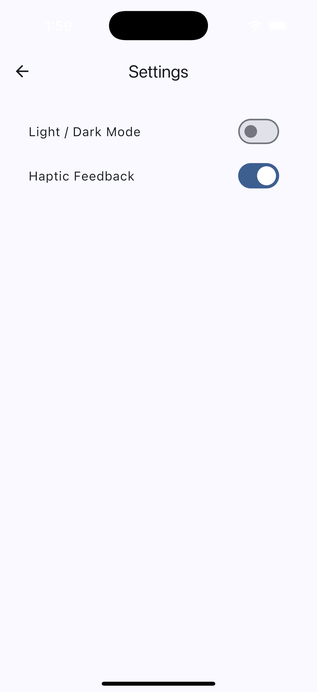
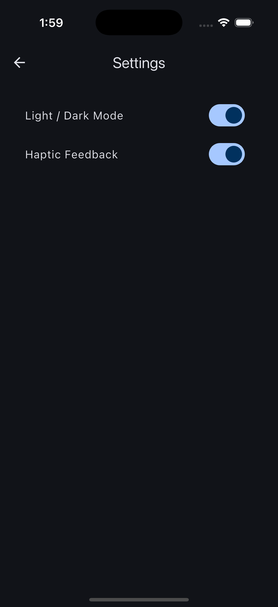

# Pop

One of my favorite things to learn about and excel at is fitness. Recently, I was getting into meditation and breathwork and discovered the struggles that come with mastering these practices. Because of this, I created a Flutter app called **Pop**. Pop is a box breathing app that effectively guides the user through box breathing using both visual and haptic cues. The app's goal is to help users reduce stress, improve focus, and enhance overall well-being.

## Key Features

- **Guided Breathing Exercise:**  
  - Animates a breathing circle that expands and contracts, guiding users through the four-step box breathing process: *Inhale*, *Hold*, *Exhale*, *Hold*.  
  - Provides visual cues and a countdown during the breathing cycle.
  
- **Session Logging:**  
  - Records breathing sessions with details such as the session date, start and end times, and total duration.  
  - Uses SQLite (via the `sqflite` package) to maintain a local log of sessions.

- **Customizable Settings:**  
  - Toggle between light and dark themes with real-time updates.  
  - Enable or disable haptic feedback to enrich the meditative experience.  
  - Manage preferences using `SharedPreferences`.

- **Informative Guidance:**  
  - Offers an info page that explains the benefits and technique behind box breathing.  
  - Provides instructions on incorporating box breathing into daily routines.

- **User-Friendly Interface:**  
  - Clean, minimal design with smooth animations and an intuitive navigation system using a bottom navigation bar.  
  - Modular pages including Home, Breathing, Log, and Settings.

## Project Structure

- **main.dart:**  
  Initializes the app, sets the theme based on user preferences, and integrates the haptic feedback service.
  
- **breathing_page.dart:**  
  Implements the interactive breathing exercise with animated transitions and countdown functionality.
  
- **notes_page.dart & database_helper.dart:**  
  Provide functionality for logging and managing breathing sessions using an SQLite database.
  
- **setting_page.dart:**  
  Allows users to switch between light/dark mode and toggle haptic feedback.
  
- **info_page.dart:**  
  Gives users an overview of the box breathing technique and its benefits.
  
- **haptic_service.dart:**  
  Manages haptic feedback settings and ensures smooth integration with the app's interactions.

## Screenshots

### Breath

  

### Home Page
<table>
  <tr>
    <td align="center">
      
    </td>
    <td align="center">
      
    </td>
  </tr>
  <tr>
    <td align="center"><strong>Light Mode</strong></td>
    <td align="center"><strong>Dark Mode</strong></td>
  </tr>
</table>

### Logs Page
<table>
  <tr>
    <td align="center">
      
    </td>
    <td align="center">
      
    </td>
  </tr>
  <tr>
    <td align="center"><strong>Light Mode Logs</strong></td>
    <td align="center"><strong>Dark Mode Logs</strong></td>
  </tr>
</table>

### Settings Page
<table>
  <tr>
    <td align="center">
      
    </td>
    <td align="center">
      
    </td>
  </tr>
  <tr>
    <td align="center"><strong>Light Mode Settings</strong></td>
    <td align="center"><strong>Dark Mode Settings</strong></td>
  </tr>
</table>

## Demo
https://github.com/user-attachments/assets/372c184e-f23d-43c1-aee0-28a4193f7c3a
